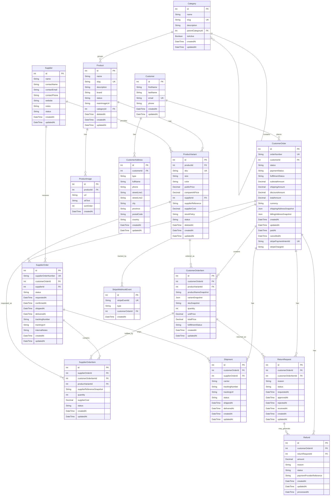

# Data Model Documentation

This document describes the data model for the women's fashion ecommerce application, including entity descriptions, field definitions, relationships, and an entity-relationship diagram.

The initial business model is supplier-fulfilled ecommerce:

* The store does not manage its own warehouse at the beginning.
* Customers place orders through the online store.
* Store administrators process supplier orders in the background.
* Suppliers may ship products directly to customers.
* The model must support future evolution to internal stock, hybrid fulfillment, multiple suppliers, and supplier automation.

## Model Descriptions

### 1. Category

Represents a product category used to organize the online catalog. Supports optional parent-child hierarchy for two-level category trees.

Examples:

* Dresses
* Bags
* Shoes
* Accessories
* Jewelry

**Fields:**

* `id`: Auto-incremented integer primary key
* `name`: Category name — unique, required
* `description`: Category description (optional)
* `imageUrl`: URL for the category image (optional, stored as plain string)
* `status`: Lifecycle status — `Active` or `Inactive` (default: `Active`)
* `parentId`: Foreign key referencing another Category for optional hierarchy (nullable)
* `createdAt`: Timestamp when the category was created
* `updatedAt`: Timestamp when the category was last updated

**Validation Rules:**

* `name` is required and must be unique across all categories
* `status` must be `Active` or `Inactive` if provided
* `parentId` must reference an existing category if provided; a category cannot reference itself

**Soft Delete:**

Categories are soft-deleted by setting `status = Inactive` rather than removing the row. This preserves referential integrity with future `Product` references.

**Relationships:**

* `parent`: Many-to-one self-referencing relationship with Category model (via `parentId`)
* `children`: One-to-many self-referencing relationship with Category model
* `products`: One-to-many relationship with Product model (planned)

### 2. Product

Represents a product sold in the online store.

A product is the public catalog item. It may have one or more variants depending on size, color, or other attributes.

**Fields:**

* `id`: Unique identifier for the product (Primary Key)
* `name`: Product name (max 150 characters)
* `slug`: Unique URL-friendly product identifier (max 200 characters); auto-generated from name in kebab-case with up to 5 collision retries
* `description`: Product description (optional, max 2000 characters)
* `brand`: Product brand or label name (optional, max 100 characters)
* `status`: Current product status (valid values: Draft, Active, Inactive, Archived)
* `mainImageUrl`: Main product image URL (optional, max 500 characters)
* `categoryId`: Foreign key referencing the Category
* `deletedAt`: Soft-delete timestamp — null means active, non-null means deleted
* `createdAt`: Date and time when the product was created
* `updatedAt`: Date and time when the product was last updated

**Validation Rules:**

* Name is required and cannot exceed 150 characters
* Slug is auto-generated from name; must be unique and cannot exceed 200 characters
* Description is optional but cannot exceed 2000 characters
* Brand is optional but cannot exceed 100 characters
* Status must be one of: Draft, Active, Inactive, Archived
* Category reference is optional but must exist in the database if provided
* A product must have at least one active variant to be set to Active (`PRODUCT_REQUIRES_ACTIVE_VARIANT`)
* An Archived product cannot be reactivated (`PRODUCT_ARCHIVED_CANNOT_REACTIVATE`)

**Status Lifecycle:**

```
Draft → Active (requires ≥1 active variant) → Inactive
Draft → Archived
Active → Inactive → Active (re-activation allowed)
Active/Inactive → Archived (terminal — cannot reactivate)
```

**Soft Delete:**

Products are soft-deleted by setting `deletedAt = now()` rather than removing the row. Soft-deleted products are excluded from all `findAll` queries and return 404 on `findById`.

**Relationships:**

* `category`: Many-to-one relationship with Category model
* `variants`: One-to-many relationship with ProductVariant model
* `images`: One-to-many relationship with ProductImage model
* `translations`: One-to-many relationship with ProductTranslation model (locale-specific name/description)
* `customerOrderItems`: One-to-many relationship with CustomerOrderItem model through ProductVariant

### 3. ProductTranslation

Stores locale-specific name and description overrides for a product. Enables multilingual product content without modifying the base `Product` entity.

**Fields:**

* `id`: Auto-incremented integer primary key
* `productId`: Foreign key referencing the Product (required)
* `locale`: BCP 47 language tag, max 5 characters — supported values: `en`, `es`
* `name`: Translated product name (required, max 150 characters)
* `description`: Translated product description (optional, max 2000 characters)
* `source`: How the translation was created — `manual` (admin UI), `import` (backfill script), or `machine` (auto-translated via LibreTranslate)
* `createdAt`: Timestamp when the translation was created
* `updatedAt`: Timestamp when the translation was last updated

**Validation Rules:**

* `locale` must be one of `en` or `es` (`TRANSLATION_LOCALE_INVALID` if invalid)
* `name` is required and cannot exceed 150 characters
* `description` is optional but cannot exceed 2000 characters
* Only one row per `(productId, locale)` pair — enforced by `@@unique([productId, locale])`

**Locale Resolution (fallback chain):**

When a public API request includes `Accept-Language: es` (or `es-ES`, region stripped to `es`):
1. Return the `es` translation row if it exists
2. Otherwise return the `en` translation row if it exists
3. Otherwise return `Product.name` / `Product.description` (the original English fallback)

Unknown locales (e.g., `fr`) default to the `en` chain above.

**Soft Delete:**

Not applicable. Translations are hard-deleted via `DELETE /api/admin/products/:id/translations/:locale`. Deleting the parent Product cascades and removes all its translations (`ON DELETE CASCADE`).

**Relationships:**

* `product`: Many-to-one relationship with Product model (FK with `ON DELETE CASCADE`)

**ERD note:** `Product ||--o{ ProductTranslation : "translated_by"`

### 4. ProductVariant

Represents a specific sellable version of a product.

Examples:

* Black dress, size S
* Beige handbag
* Nude sandals, size 38

**Fields:**

* `id`: Unique identifier for the product variant (Primary Key)
* `productId`: Foreign key referencing the Product
* `sku`: Internal stock keeping unit, unique across variants (max 100 characters)
* `size`: Product size (optional, max 50 characters)
* `color`: Product color (optional, max 50 characters)
* `publicPrice`: Price shown to customers
* `compareAtPrice`: Optional previous price or crossed-out price (must be strictly greater than publicPrice)
* `supplierId`: Foreign key referencing the Supplier (optional) — **INTERNAL ONLY, never returned by API**
* `supplierReference`: Supplier product reference (optional, max 150 characters) — **INTERNAL ONLY, never returned by API**
* `supplierCost`: Internal supplier cost — **INTERNAL ONLY, never returned by API**
* `stockPolicy`: Stock policy (valid values: SupplierManaged, InternalStock, Hybrid)
* `status`: Variant status (valid values: Active, Inactive, OutOfStock, Archived)
* `deletedAt`: Soft-delete timestamp — null means active, non-null means deleted
* `createdAt`: Date and time when the variant was created
* `updatedAt`: Date and time when the variant was last updated

**Validation Rules:**

* Product reference is required and must exist in the database
* SKU is required, must be unique, and cannot exceed 100 characters
* Public price is required and must be greater than 0
* Compare-at price is optional but must be **strictly greater** than public price if provided (enforced with HTTP 422 `VARIANT_COMPARE_PRICE_INVALID`)
* Supplier reference is optional but cannot exceed 150 characters
* Supplier cost is optional but must be greater than or equal to 0 if provided
* Stock policy must be one of: SupplierManaged, InternalStock, Hybrid
* Status must be one of: Active, Inactive, OutOfStock, Archived

**Supplier Field Protection (CRITICAL):**

The fields `supplierId`, `supplierReference`, and `supplierCost` are stored in the database but **must never appear in any API response**. This is enforced at the Prisma repository layer via a `variantSelect` constant that explicitly omits these fields from all read operations. Automated tests assert their absence on every variant query and controller response.

**Relationships:**

* `product`: Many-to-one relationship with Product model
* `supplier`: Many-to-one relationship with Supplier model
* `customerOrderItems`: One-to-many relationship with CustomerOrderItem model
* `supplierOrderItems`: One-to-many relationship with SupplierOrderItem model

### 4. ProductImage

Represents images associated with a product.

**Fields:**

* `id`: Unique identifier for the product image (Primary Key)
* `productId`: Foreign key referencing the Product
* `url`: Image URL or storage path (max 500 characters)
* `altText`: Alternative text for accessibility and SEO (optional, max 250 characters)
* `sortOrder`: Numeric order used to display product images
* `createdAt`: Date and time when the image was created

**Validation Rules:**

* Product reference is required and must exist in the database
* URL is required and cannot exceed 500 characters
* Alternative text is optional but cannot exceed 250 characters
* Sort order must be greater than or equal to 0

**Relationships:**

* `product`: Many-to-one relationship with Product model

### 5. Supplier

Represents an external supplier or provider.

In the initial business model, suppliers may ship products directly to customers after store administrators process supplier orders in the background.

**Fields:**

* `id`: Unique identifier for the supplier (Primary Key)
* `name`: Supplier name (max 150 characters)
* `contactName`: Main contact person (optional, max 150 characters)
* `contactEmail`: Supplier contact email (optional, max 255 characters)
* `contactPhone`: Supplier contact phone number (optional, max 30 characters)
* `website`: Supplier website URL (optional, max 500 characters)
* `notes`: Internal supplier notes (optional, max 2000 characters)
* `status`: Supplier status (valid values: Active, Inactive, Blocked)
* `createdAt`: Date and time when the supplier was created
* `updatedAt`: Date and time when the supplier was last updated

**Validation Rules:**

* Name is required and cannot exceed 150 characters
* Contact email is optional but must follow valid email format if provided
* Contact phone is optional and cannot exceed 30 characters
* Website is optional and cannot exceed 500 characters
* Notes are internal only and cannot exceed 2000 characters
* Status must be one of: Active, Inactive, Blocked
* Supplier data must not be exposed through customer-facing APIs unless explicitly required

**Relationships:**

* `productVariants`: One-to-many relationship with ProductVariant model
* `supplierOrders`: One-to-many relationship with SupplierOrder model

### 6. Customer

Represents a customer who buys from the online store.

**Fields:**

* `id`: Unique identifier for the customer (Primary Key)
* `firstName`: Customer's first name (max 100 characters)
* `lastName`: Customer's last name (max 100 characters)
* `email`: Customer's unique email address (max 255 characters)
* `phone`: Customer's phone number (optional, max 30 characters)
* `createdAt`: Date and time when the customer was created
* `updatedAt`: Date and time when the customer was last updated

**Validation Rules:**

* First name is required and cannot exceed 100 characters
* Last name is required and cannot exceed 100 characters
* Email is required, must be unique, and follow valid email format
* Phone is optional and cannot exceed 30 characters
* Customer personal data must be protected and never exposed to unauthorized users

**Relationships:**

* `addresses`: One-to-many relationship with CustomerAddress model
* `customerOrders`: One-to-many relationship with CustomerOrder model
* `account`: Optional one-to-one relationship with CustomerAccount model

### 6b. AdminUser

Store administrator credentials for the admin panel (MVP: single seeded admin).

**Fields:** `id`, `email` (unique), `passwordHash`, `status` (Active | Disabled), `createdAt`, `updatedAt`

**Relationships:** `refreshTokens` → AdminRefreshToken

### 6c. CustomerAccount

Buyer login identity linked 1:1 to Customer. Supports local password, OAuth (Google/Apple/Facebook), and optional TOTP 2FA.

**Fields:** `id`, `customerId` (unique FK), `email` (unique), `passwordHash?`, `authProvider`, OAuth ids, `status`, `totpSecret?`, `totpEnabled`, `lastLoginAt`, timestamps

**Relationships:** `customer`, `refreshTokens`, `resetTokens`, `wishlistItems`

### 6d. WishlistItem

Authenticated buyer saved variant. Unique per (`customerAccountId`, `productVariantId`).

### 6e. Coupon / CouponRedemption

Promotional codes validated at checkout. `CouponRedemption` links a coupon to a `CustomerOrder` with `discountAmount`.

Welcome coupons are auto-generated on new customer registration: `type = "percentage"`, `maxUses = 1`, code prefix `WELCOME-` followed by 32 uppercase hex characters. No `customerId` FK — the prefix provides traceability without a schema migration.

### 7. CustomerAddress

Represents a customer's shipping or billing address.

**Fields:**

* `id`: Unique identifier for the address (Primary Key)
* `customerId`: Foreign key referencing the Customer
* `type`: Address type (valid values: Shipping, Billing)
* `fullName`: Recipient full name (max 150 characters)
* `phone`: Contact phone number (optional, max 30 characters)
* `streetLine1`: First address line (max 150 characters)
* `streetLine2`: Second address line (optional, max 150 characters)
* `city`: City name (max 100 characters)
* `province`: Province, region, or state (max 100 characters)
* `postalCode`: Postal code (max 20 characters)
* `country`: Country name or ISO code (max 100 characters)
* `createdAt`: Date and time when the address was created
* `updatedAt`: Date and time when the address was last updated

**Validation Rules:**

* Customer reference is required and must exist in the database
* Type must be one of: Shipping, Billing
* Full name is required and cannot exceed 150 characters
* Street line 1 is required and cannot exceed 150 characters
* City is required and cannot exceed 100 characters
* Province is required and cannot exceed 100 characters
* Postal code is required and cannot exceed 20 characters
* Country is required and cannot exceed 100 characters
* Phone is optional and cannot exceed 30 characters

**Relationships:**

* `customer`: Many-to-one relationship with Customer model

### 8. CustomerOrder

Represents an order placed by a customer in the online store.

A customer order is different from a supplier order. The customer order represents what the customer bought from the store. Supplier orders represent what the store requests from suppliers in the background.

**Fields:**

* `id`: Unique identifier for the customer order (Primary Key)
* `orderNumber`: Human-readable unique order number (max 50 characters)
* `customerId`: Foreign key referencing the Customer
* `status`: Customer-facing order status (valid values: PendingPayment, Paid, Processing, Completed, Cancelled, Refunded)
* `paymentStatus`: Payment status (valid values: Pending, Authorized, Paid, Failed, Refunded, PartiallyRefunded)
* `fulfillmentStatus`: Internal fulfillment status (valid values: NotStarted, PendingSupplierOrder, SupplierOrderPlaced, PartiallyFulfilled, Fulfilled, Blocked, Cancelled)
* `subtotalAmount`: Order subtotal amount
* `shippingAmount`: Shipping amount
* `discountAmount`: Discount amount
* `totalAmount`: Total order amount
* `currency`: Currency code (for example, EUR)
* `shippingAddressSnapshot`: JSON snapshot of the shipping address at purchase time
* `billingAddressSnapshot`: JSON snapshot of the billing address at purchase time
* `createdAt`: Date and time when the order was created
* `updatedAt`: Date and time when the order was last updated
* `paidAt`: Date and time when the order was paid (optional)
* `cancelledAt`: Date and time when the order was cancelled (optional)
* `stripePaymentIntentId`: Stripe PaymentIntent ID stored after checkout (optional, unique, max 255 characters) — **INTERNAL ONLY, never returned by public API**
* `stripeChargeId`: Stripe Charge ID stored after payment succeeds (optional, max 255 characters) — **INTERNAL ONLY, never returned by public API**

**Validation Rules:**

* Order number is required and must be unique
* Customer reference is required and must exist in the database
* Status must be one of: PendingPayment, Paid, Processing, Completed, Cancelled, Refunded
* Payment status must be one of: Pending, Authorized, Paid, Failed, Refunded, PartiallyRefunded
* Fulfillment status must be one of: NotStarted, PendingSupplierOrder, SupplierOrderPlaced, PartiallyFulfilled, Fulfilled, Blocked, Cancelled
* Subtotal amount, shipping amount, discount amount, and total amount must be greater than or equal to 0
* Currency is required and should use ISO 4217 format
* Shipping and billing address snapshots are required once the order is placed
* A paid order cannot move back to PendingPayment
* A cancelled order cannot generate new supplier orders
* Fulfillment status must be updated separately from customer-facing order status

**Relationships:**

* `customer`: Many-to-one relationship with Customer model
* `items`: One-to-many relationship with CustomerOrderItem model
* `supplierOrders`: One-to-many relationship with SupplierOrder model
* `shipments`: One-to-many relationship with Shipment model
* `returnRequests`: One-to-many relationship with ReturnRequest model
* `refunds`: One-to-many relationship with Refund model
* `stripeWebhookEvents`: One-to-many relationship with StripeWebhookEvent model

**paymentStatus Stripe Transition:**

```
Pending         → Paid               (via payment_intent.succeeded webhook)
Pending         → Failed             (via payment_intent.payment_failed webhook)
Paid            → PartiallyRefunded  (via charge.refunded webhook — partial)
Paid            → Refunded           (via charge.refunded webhook — full)
PartiallyRefunded → Refunded         (via charge.refunded webhook — balance reaches 0)
```

`paymentStatus` is set exclusively from Stripe webhook events. The `POST /api/public/checkout` response includes a `clientSecret` for the frontend to confirm payment. `Paid` is never set from the checkout API call itself.

### 9. CustomerOrderItem

Represents one line item inside a customer order.

Product and variant data should be snapshotted because products, prices, and supplier information may change after the order is placed.

**Fields:**

* `id`: Unique identifier for the customer order item (Primary Key)
* `customerOrderId`: Foreign key referencing the CustomerOrder
* `productVariantId`: Foreign key referencing the ProductVariant
* `productNameSnapshot`: Product name at purchase time (max 150 characters)
* `variantSnapshot`: JSON snapshot of variant attributes such as size and color
* `skuSnapshot`: SKU at purchase time (max 100 characters)
* `quantity`: Purchased quantity
* `unitPrice`: Unit price paid by the customer
* `totalPrice`: Total line amount
* `fulfillmentStatus`: Fulfillment status for this line item
* `createdAt`: Date and time when the item was created
* `updatedAt`: Date and time when the item was last updated

**Validation Rules:**

* Customer order reference is required and must exist in the database
* Product variant reference is required and must exist in the database
* Product name snapshot is required and cannot exceed 150 characters
* SKU snapshot is required and cannot exceed 100 characters
* Quantity is required and must be greater than 0
* Unit price and total price must be greater than or equal to 0
* Total price should equal quantity multiplied by unit price unless discounts are explicitly modeled
* Fulfillment status must be aligned with the parent customer order fulfillment workflow

**Relationships:**

* `customerOrder`: Many-to-one relationship with CustomerOrder model
* `productVariant`: Many-to-one relationship with ProductVariant model
* `supplierOrderItems`: One-to-many relationship with SupplierOrderItem model
* `returnRequests`: One-to-many relationship with ReturnRequest model

### 10. SupplierOrder

Represents an internal order placed with a supplier to fulfill one or more customer order items.

A single customer order may generate multiple supplier orders if products belong to different suppliers.

**Fields:**

* `id`: Unique identifier for the supplier order (Primary Key)
* `supplierOrderNumber`: Human-readable unique supplier order number (max 50 characters)
* `customerOrderId`: Foreign key referencing the CustomerOrder
* `supplierId`: Foreign key referencing the Supplier
* `status`: Supplier order status (valid values: Draft, Requested, Confirmed, OutOfStock, Shipped, Delivered, Cancelled)
* `requestedAt`: Date and time when the supplier order was requested (optional)
* `confirmedAt`: Date and time when the supplier confirmed the order (optional)
* `shippedAt`: Date and time when the supplier shipped the order (optional)
* `deliveredAt`: Date and time when the order was delivered (optional)
* `trackingNumber`: Tracking number provided by the supplier or carrier (optional, max 100 characters)
* `trackingUrl`: Tracking URL (optional, max 500 characters)
* `internalNotes`: Internal notes for administrators (optional, max 2000 characters)
* `createdAt`: Date and time when the supplier order was created
* `updatedAt`: Date and time when the supplier order was last updated

**Validation Rules:**

* Supplier order number is required and must be unique
* Customer order reference is required and must exist in the database
* Supplier reference is required and must exist in the database
* Status must be one of: Draft, Requested, Confirmed, OutOfStock, Shipped, Delivered, Cancelled
* Tracking number is optional and cannot exceed 100 characters
* Tracking URL is optional and cannot exceed 500 characters
* Internal notes are optional and cannot exceed 2000 characters
* Supplier orders can only be created from paid or processing customer orders
* A supplier order belongs to exactly one supplier
* Supplier order status transitions must be explicit and validated

**Relationships:**

* `customerOrder`: Many-to-one relationship with CustomerOrder model
* `supplier`: Many-to-one relationship with Supplier model
* `items`: One-to-many relationship with SupplierOrderItem model
* `shipments`: One-to-many relationship with Shipment model

### 11. SupplierOrderItem

Represents one line item inside a supplier order.

**Fields:**

* `id`: Unique identifier for the supplier order item (Primary Key)
* `supplierOrderId`: Foreign key referencing the SupplierOrder
* `customerOrderItemId`: Foreign key referencing the CustomerOrderItem
* `productVariantId`: Foreign key referencing the ProductVariant
* `supplierReferenceSnapshot`: Supplier reference at order time (optional, max 150 characters)
* `quantity`: Quantity requested from the supplier
* `supplierCost`: Internal supplier cost at order time
* `status`: Supplier order item status (valid values: Draft, Requested, Confirmed, OutOfStock, Shipped, Delivered, Cancelled)
* `createdAt`: Date and time when the item was created
* `updatedAt`: Date and time when the item was last updated

**Validation Rules:**

* Supplier order reference is required and must exist in the database
* Customer order item reference is required and must exist in the database
* Product variant reference is required and must exist in the database
* Quantity is required and must be greater than 0
* Supplier cost must be greater than or equal to 0
* Supplier cost must never be exposed through customer-facing APIs
* Status must be one of: Draft, Requested, Confirmed, OutOfStock, Shipped, Delivered, Cancelled

**Relationships:**

* `supplierOrder`: Many-to-one relationship with SupplierOrder model
* `customerOrderItem`: Many-to-one relationship with CustomerOrderItem model
* `productVariant`: Many-to-one relationship with ProductVariant model

### 12. Shipment

Represents shipment information for a customer order or supplier order.

In the initial model, shipments may be created when the supplier ships products directly to the customer.

**Fields:**

* `id`: Unique identifier for the shipment (Primary Key)
* `customerOrderId`: Foreign key referencing the CustomerOrder
* `supplierOrderId`: Foreign key referencing the SupplierOrder (optional)
* `carrier`: Carrier or shipping company name (optional, max 100 characters)
* `trackingNumber`: Tracking number (optional, max 100 characters)
* `trackingUrl`: Tracking URL (optional, max 500 characters)
* `status`: Shipment status (valid values: Pending, Shipped, InTransit, Delivered, Failed, Returned)
* `shippedAt`: Date and time when the shipment was shipped (optional)
* `deliveredAt`: Date and time when the shipment was delivered (optional)
* `createdAt`: Date and time when the shipment was created
* `updatedAt`: Date and time when the shipment was last updated

**Validation Rules:**

* Customer order reference is required and must exist in the database
* Supplier order reference is optional but must exist in the database if provided
* Carrier is optional and cannot exceed 100 characters
* Tracking number is optional and cannot exceed 100 characters
* Tracking URL is optional and cannot exceed 500 characters
* Status must be one of: Pending, Shipped, InTransit, Delivered, Failed, Returned
* Delivered date cannot be earlier than shipped date

**Relationships:**

* `customerOrder`: Many-to-one relationship with CustomerOrder model
* `supplierOrder`: Many-to-one relationship with SupplierOrder model

### 13. ReturnRequest

Represents a customer's return request.

**Fields:**

* `id`: Unique identifier for the return request (Primary Key)
* `customerOrderId`: Foreign key referencing the CustomerOrder
* `customerOrderItemId`: Foreign key referencing the CustomerOrderItem
* `reason`: Return reason (max 500 characters)
* `status`: Return request status (valid values: Requested, Approved, Rejected, Received, Refunded, Cancelled)
* `requestedAt`: Date and time when the return was requested
* `approvedAt`: Date and time when the return was approved (optional)
* `rejectedAt`: Date and time when the return was rejected (optional)
* `receivedAt`: Date and time when the returned item was received (optional)
* `createdAt`: Date and time when the return request was created
* `updatedAt`: Date and time when the return request was last updated

**State Machine:**

```
Requested → Approved | Rejected | Cancelled
Approved  → Received | Cancelled
Received  → Refunded | Cancelled

Terminal states: Rejected, Refunded, Cancelled (no further transitions allowed)
```

Timestamps set automatically on transition:
- `approvedAt` — set when transitioning to `Approved`
- `rejectedAt` — set when transitioning to `Rejected`
- `receivedAt` — set when transitioning to `Received`

**Validation Rules:**

* Customer order reference is required and must exist in the database
* Customer order item reference is required and must exist in the database
* Reason is required and cannot exceed 500 characters
* Status must be one of: Requested, Approved, Rejected, Received, Refunded, Cancelled
* A return request cannot be created for a cancelled customer order (`RETURN_REQUEST_ORDER_CANCELLED`)
* The customer order item must belong to the specified customer order (`RETURN_REQUEST_ITEM_MISMATCH`)
* Status transitions must follow the state machine above (`RETURN_REQUEST_TRANSITION_INVALID`)

**Relationships:**

* `customerOrder`: Many-to-one relationship with CustomerOrder model
* `customerOrderItem`: Many-to-one relationship with CustomerOrderItem model
* `refunds`: One-to-many relationship with Refund model

### 14. Refund

Represents a full or partial refund associated with a customer order.

**Fields:**

* `id`: Unique identifier for the refund (Primary Key)
* `customerOrderId`: Foreign key referencing the CustomerOrder (required)
* `returnRequestId`: Optional nullable FK referencing a ReturnRequest (ON DELETE SET NULL) — materialized in migration `20260619061633_add_return_request` (KAN-25)
* `amount`: Refunded amount (Decimal 10,2 — stored as string in domain/API)
* `reason`: Refund reason (optional, max 500 characters)
* `status`: Refund status (valid values: Pending, Processing, Completed, Failed, Cancelled)
* `paymentProviderReference`: External payment provider reference set manually by admin (optional, max 150 characters)
* `createdAt`: Date and time when the refund was created
* `updatedAt`: Date and time when the refund was last updated
* `processedAt`: Date and time when the refund was processed — set automatically when transitioning to `Completed` (optional)

**State Machine:**

```
Pending → Processing
Pending → Cancelled
Processing → Completed  (sets processedAt; triggers paymentStatus recalculation)
Processing → Failed     (triggers paymentStatus recalculation)
Processing → Cancelled  (triggers paymentStatus recalculation)

Terminal states: Completed, Failed, Cancelled (no further transitions allowed)
```

**Validation Rules:**

* Customer order reference is required and must exist in the database
* Order `paymentStatus` must be `Paid` or `PartiallyRefunded` to create a refund (`REFUND_ORDER_NOT_PAID`)
* Amount is required and must be greater than 0
* Amount must not exceed `CustomerOrder.totalAmount − Σ refunds[status IN (Completed, Processing)]` — validated inside a Prisma transaction (`REFUND_AMOUNT_EXCEEDS_BALANCE`)
* Reason is optional but cannot exceed 500 characters
* Status must be one of: Pending, Processing, Completed, Failed, Cancelled
* Status transitions must follow the state machine above (`REFUND_TRANSITION_INVALID`)
* Payment provider reference is optional and cannot exceed 150 characters
* `returnRequestId` is nullable; when provided, the referenced ReturnRequest must exist (validated inside the Prisma transaction — `RETURN_REQUEST_NOT_FOUND`)

**paymentStatus Synchronization:**

`CustomerOrder.paymentStatus` is recalculated inside the same Prisma transaction on every refund create or status change:
- `Σ Completed refunds == totalAmount` → `Refunded`
- `0 < Σ Completed refunds < totalAmount` → `PartiallyRefunded`
- `Σ Completed refunds == 0` → no change (e.g., after a cancellation)

**Relationships:**

* `customerOrder`: Many-to-one relationship with CustomerOrder model
* `returnRequest`: Optional many-to-one relationship with ReturnRequest model (real DB FK — ON DELETE SET NULL)

### 15. StripeWebhookEvent

Idempotency log for Stripe webhook events received at `POST /api/public/payments/webhook`.

Prevents double-processing of the same webhook if Stripe retries delivery.

**Fields:**

* `id`: Auto-incremented integer primary key
* `stripeEventId`: Stripe event ID from `event.id` — unique constraint enforces idempotency
* `type`: Stripe event type string (e.g., `payment_intent.succeeded`, `charge.refunded`)
* `customerOrderId`: Optional FK referencing CustomerOrder — set when the event relates to a known order
* `createdAt`: Timestamp when the event was first processed

**Validation Rules:**

* `stripeEventId` must be unique — duplicate events are silently ignored (idempotent)
* `customerOrderId` is nullable; the order may not yet be found at event processing time

**Security:**

* This table is only written to by the backend webhook handler after signature verification
* Raw event payloads are NOT stored — only the event ID and type
* Never exposed through any API response

**Relationships:**

* `customerOrder`: Optional many-to-one relationship with CustomerOrder model

## Entity Relationship Diagram



## Key Design Principles

1. **Customer Orders and Supplier Orders Are Different**: A customer order represents what the customer buys. A supplier order represents what the store requests from a supplier in the background.

2. **Supplier-Fulfilled First**: The initial model assumes that the store does not manage its own warehouse and that products are fulfilled by suppliers.

3. **Future Fulfillment Flexibility**: The model supports future internal stock, hybrid fulfillment, multiple suppliers, and supplier automation.

4. **Supplier Data Protection**: Supplier costs, supplier references, supplier notes, and internal fulfillment data must never be exposed through customer-facing APIs.

5. **Snapshot-Based Ordering**: Customer order items store snapshots of product and variant data to preserve order history even if products change later.

6. **Separate Status Models**: Customer-facing order status, payment status, fulfillment status, supplier order status, shipment status, return status, and refund status are separate concepts.

7. **Referential Integrity**: All foreign key relationships ensure data consistency across the system.

8. **Extensibility**: The modular design allows for easy addition of new fulfillment workflows, supplier integrations, payment providers, and reporting features.

9. **Data Normalization**: The model follows database normalization principles while using snapshots where historical accuracy is required.

10. **Audit Trail**: Created, updated, paid, shipped, delivered, cancelled, requested, approved, rejected, and processed dates provide a traceable business timeline.

## Notes

* All `id` fields serve as primary keys with auto-increment functionality.
* Foreign key relationships maintain referential integrity.
* Optional fields allow flexible data entry while maintaining required core information.
* Product variants are the sellable units of the catalog.
* Supplier cost is internal-only information and must never be included in public product or order responses.
* Customer order status and fulfillment status must not be mixed.
* A single customer order may generate multiple supplier orders.
* A supplier order belongs to exactly one supplier.
* Address snapshots preserve the exact shipping and billing information used at the time of purchase.
* Future versions may include carts, coupons, inventory movements, payment transactions, supplier API credentials, audit logs, and admin users.
