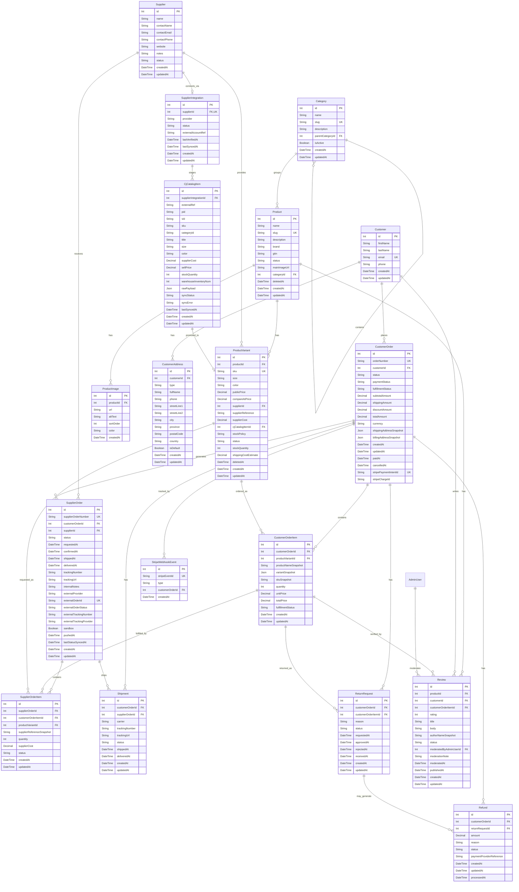

# Data Model Documentation

This document describes the data model for the women's fashion ecommerce application, including entity descriptions, field definitions, relationships, and an entity-relationship diagram.

The initial business model is supplier-fulfilled ecommerce:

* The store does not manage its own warehouse at the beginning.
* Customers place orders through the online store.
* Store administrators process supplier orders in the background.
* Suppliers may ship products directly to customers.
* The model must support future evolution to internal stock, hybrid fulfillment, multiple suppliers, and supplier automation.

## Model Descriptions

### 1. Category

Represents a product category used to organize the online catalog. Supports optional parent-child hierarchy for two-level category trees.

Examples:

* Dresses
* Bags
* Shoes
* Accessories
* Jewelry

**Fields:**

* `id`: Auto-incremented integer primary key
* `name`: Category name — unique, required
* `description`: Category description (optional)
* `imageUrl`: URL for the category image (optional, stored as plain string)
* `status`: Lifecycle status — `Active` or `Inactive` (default: `Active`)
* `parentId`: Foreign key referencing another Category for optional hierarchy (nullable)
* `createdAt`: Timestamp when the category was created
* `updatedAt`: Timestamp when the category was last updated

**Validation Rules:**

* `name` is required and must be unique across all categories
* `status` must be `Active` or `Inactive` if provided
* `parentId` must reference an existing category if provided; a category cannot reference itself

**Soft Delete:**

Categories are soft-deleted by setting `status = Inactive` rather than removing the row. This preserves referential integrity with future `Product` references.

**Relationships:**

* `parent`: Many-to-one self-referencing relationship with Category model (via `parentId`)
* `children`: One-to-many self-referencing relationship with Category model
* `products`: One-to-many relationship with Product model (planned)

### 2. Product

Represents a product sold in the online store.

A product is the public catalog item. It may have one or more variants depending on size, color, or other attributes.

**Fields:**

* `id`: Unique identifier for the product (Primary Key)
* `name`: Product name (max 150 characters)
* `slug`: Unique URL-friendly product identifier (max 200 characters); auto-generated from name in kebab-case with up to 5 collision retries
* `description`: Product description (optional, max 2000 characters)
* `brand`: Product brand or label name (optional, max 100 characters)
* `gtin`: International trade item identifier — GTIN/EAN/UPC (optional, digits only, length 8, 12, 13, or 14 characters). Modeled at the product level, not per variant, in this iteration. Used to populate `gtin13`/`gtin` in storefront Product structured data (JSON-LD) when present; omitted from structured data when absent — never fabricated.
* `status`: Current product status (valid values: Draft, Active, Inactive, Archived)
* `mainImageUrl`: Main product image URL (optional, max 500 characters)
* `categoryId`: Foreign key referencing the Category
* `deletedAt`: Soft-delete timestamp — null means active, non-null means deleted
* `createdAt`: Date and time when the product was created
* `updatedAt`: Date and time when the product was last updated

**Validation Rules:**

* Name is required and cannot exceed 150 characters
* Slug is auto-generated from name; must be unique and cannot exceed 200 characters
* Description is optional but cannot exceed 2000 characters
* Brand is optional but cannot exceed 100 characters
* GTIN is optional; when provided it must contain only digits and be 8, 12, 13, or 14 characters long (`VALIDATION_ERROR` otherwise); an empty string normalizes to `null` rather than being rejected. Validated on both create and update.
* Status must be one of: Draft, Active, Inactive, Archived
* Category reference is optional but must exist in the database if provided
* A product must have at least one active variant to be set to Active (`PRODUCT_REQUIRES_ACTIVE_VARIANT`)
* An Archived product cannot be reactivated (`PRODUCT_ARCHIVED_CANNOT_REACTIVATE`)

**Status Lifecycle:**

```
Draft → Active (requires ≥1 active variant) → Inactive
Draft → Archived
Active → Inactive → Active (re-activation allowed)
Active/Inactive → Archived (terminal — cannot reactivate)
```

**Soft Delete:**

Products are soft-deleted by setting `deletedAt = now()` rather than removing the row. Soft-deleted products are excluded from all `findAll` queries and return 404 on `findById`.

**Relationships:**

* `category`: Many-to-one relationship with Category model
* `variants`: One-to-many relationship with ProductVariant model
* `images`: One-to-many relationship with ProductImage model
* `translations`: One-to-many relationship with ProductTranslation model (locale-specific name/description)
* `customerOrderItems`: One-to-many relationship with CustomerOrderItem model through ProductVariant
* `reviews`: One-to-many relationship with Review model (product-level scope — one review per customer per product)

### 3. ProductTranslation

Stores locale-specific name and description overrides for a product. Enables multilingual product content without modifying the base `Product` entity.

**Fields:**

* `id`: Auto-incremented integer primary key
* `productId`: Foreign key referencing the Product (required)
* `locale`: BCP 47 language tag, max 5 characters — supported values: `en`, `es`
* `name`: Translated product name (required, max 150 characters)
* `description`: Translated product description (optional, max 2000 characters)
* `source`: How the translation was created — `manual` (admin UI), `import` (backfill script), or `machine` (auto-translated via LibreTranslate)
* `createdAt`: Timestamp when the translation was created
* `updatedAt`: Timestamp when the translation was last updated

**Validation Rules:**

* `locale` must be one of `en` or `es` (`TRANSLATION_LOCALE_INVALID` if invalid)
* `name` is required and cannot exceed 150 characters
* `description` is optional but cannot exceed 2000 characters
* Only one row per `(productId, locale)` pair — enforced by `@@unique([productId, locale])`

**Locale Resolution (fallback chain):**

When a public API request includes `Accept-Language: es` (or `es-ES`, region stripped to `es`):
1. Return the `es` translation row if it exists
2. Otherwise return the `en` translation row if it exists
3. Otherwise return `Product.name` / `Product.description` (the original English fallback)

Unknown locales (e.g., `fr`) default to the `en` chain above.

**Soft Delete:**

Not applicable. Translations are hard-deleted via `DELETE /api/admin/products/:id/translations/:locale`. Deleting the parent Product cascades and removes all its translations (`ON DELETE CASCADE`).

**Relationships:**

* `product`: Many-to-one relationship with Product model (FK with `ON DELETE CASCADE`)

**ERD note:** `Product ||--o{ ProductTranslation : "translated_by"`

### 4. ProductVariant

Represents a specific sellable version of a product.

Examples:

* Black dress, size S
* Beige handbag
* Nude sandals, size 38

**Fields:**

* `id`: Unique identifier for the product variant (Primary Key)
* `productId`: Foreign key referencing the Product
* `sku`: Internal stock keeping unit, unique across variants (max 100 characters)
* `size`: Product size (optional, max 50 characters)
* `color`: Product color (optional, max 50 characters)
* `publicPrice`: Price shown to customers
* `compareAtPrice`: Optional previous price or crossed-out price (must be strictly greater than publicPrice)
* `supplierId`: Foreign key referencing the Supplier (optional) — **ADMIN ONLY, never returned by customer-facing APIs**
* `supplierReference`: Supplier product reference (optional, max 150 characters) — **ADMIN ONLY, never returned by customer-facing APIs**
* `supplierCost`: Internal supplier cost — **ADMIN ONLY, never returned by customer-facing APIs**; shown in the admin panel next to `publicPrice` for margin visibility
* `cjCatalogItemId`: Foreign key referencing the `CjCatalogItem` this variant was promoted from (optional, unique) — **INTERNAL ONLY, never returned by API**. Nullable+unique; `ON DELETE SET NULL` (a promoted variant survives even if its source staging row is ever deleted, since `CjCatalogItem` rows are disposable/re-syncable). Never cleared once set, including on deactivation — it is the permanent link back to the CJ origin that allows reactivating or re-syncing cost/stock later.
* `stockPolicy`: Stock policy (valid values: SupplierManaged, InternalStock, Hybrid)
* `status`: Variant status (valid values: Active, Inactive, OutOfStock, Archived)
* `stockQuantity`: Available stock for this variant (integer, default 0). **Public.** Written only by the system — kept in sync from the linked `CjCatalogItem.stockQuantity` during CJ catalog sync and promotion; read-only through `PATCH`/`POST` admin variant endpoints (any client-supplied value is silently ignored). Drives storefront combination availability: a size/color combination is only selectable when its variant is active, non-deleted, and `stockQuantity > 0`.
* `shippingCostEstimate`: Estimated per-unit freight cost (optional, 2 decimals) — **ADMIN ONLY, never returned by customer-facing APIs**. Populated by `POST /api/admin/products/:id/variants/:variantId/freight-estimate` (lowest CJ freight quote for the variant's linked `CjCatalogItem` and a destination country); `null` until refreshed at least once.
* `deletedAt`: Soft-delete timestamp — null means active, non-null means deleted
* `createdAt`: Date and time when the variant was created
* `updatedAt`: Date and time when the variant was last updated

**Derived (admin-only, not persisted) fields returned on admin variant responses:**

* `netMargin`: `publicPrice - supplierCost - shippingCostEstimate`, treating a `null` `supplierCost` or `shippingCostEstimate` as `0`. Recomputed on every admin read/write, never stored.
* `shippingEstimateMissing`: `true` when `shippingCostEstimate` is `null` — flags that `netMargin` is an approximation until the estimate is refreshed.
* `marginWarning`: `true` when `netMargin < 0` or `netMargin < AutomationSettings.targetMargin`. Drives the "Margen bajo" / "Vendiendo con pérdida" badge in the admin variant table.

**Validation Rules:**

* Product reference is required and must exist in the database
* SKU is required, must be unique, and cannot exceed 100 characters
* Public price is required and must be greater than 0
* Compare-at price is optional but must be **strictly greater** than public price if provided (enforced with HTTP 422 `VARIANT_COMPARE_PRICE_INVALID`)
* Supplier reference is optional but cannot exceed 150 characters
* Supplier cost is optional but must be greater than or equal to 0 if provided
* Stock policy must be one of: SupplierManaged, InternalStock, Hybrid
* Status must be one of: Active, Inactive, OutOfStock, Archived
* Stock quantity must be greater than or equal to 0; not settable through the admin update/create endpoints (system-managed only)
* Shipping cost estimate must be greater than or equal to 0 if provided; only settable through the freight-estimate endpoint, not through `PATCH`/`POST`

**Supplier Field Protection (CRITICAL):**

The fields `supplierId`, `supplierReference`, `supplierCost`, and `shippingCostEstimate` (plus the derived `netMargin`/`marginWarning`/`shippingEstimateMissing`) **must never appear in any customer-facing API response**. Admin endpoints (`/api/admin/products/:id/variants*`, behind admin auth) DO return them (plus a derived `supplierName`) via a dedicated `adminVariantSelect` so administrators can see cost and margin; every customer-facing serializer allow-lists its own fields (including `stockQuantity`, which IS public) and automated isolation tests assert the supplier/margin fields' absence on all `/api/public/*` responses. `cjCatalogItemId` remains internal-only and is never returned by any API, admin included.

**Relationships:**

* `product`: Many-to-one relationship with Product model
* `supplier`: Many-to-one relationship with Supplier model
* `cjCatalogItem`: One-to-one relationship with CjCatalogItem model (the origin staging record, if this variant was promoted from CJ)
* `customerOrderItems`: One-to-many relationship with CustomerOrderItem model
* `supplierOrderItems`: One-to-many relationship with SupplierOrderItem model

### 4. ProductImage

Represents images associated with a product.

**Fields:**

* `id`: Unique identifier for the product image (Primary Key)
* `productId`: Foreign key referencing the Product
* `url`: Image URL or storage path (max 500 characters)
* `altText`: Alternative text for accessibility and SEO (optional, max 250 characters)
* `sortOrder`: Numeric order used to display product images
* `color`: Optional color association (max 50 characters). `null` means the image is shared/product-level and applies regardless of the selected variant color; a non-null value ties the image to a specific `ProductVariant.color` value (same vocabulary, not a foreign key — CJ's photo varies by color, not size, so multiple variants of different sizes intentionally share one color-tagged image). For CJ-sourced products, derived the same way `ProductVariant.color` is derived (`variantKey` → `variantNameEn` → `variantProperty` precedence) from the source variant's `rawPayload`; the product-level image is always `color: null`. The storefront product detail page filters the gallery to the selected variant's color plus any `color: null` images, falling back to the full image list whenever that filter would be empty.
* `createdAt`: Date and time when the image was created

**Validation Rules:**

* Product reference is required and must exist in the database
* URL is required and cannot exceed 500 characters
* Alternative text is optional but cannot exceed 250 characters
* Sort order must be greater than or equal to 0
* Color is optional but cannot exceed 50 characters

**Relationships:**

* `product`: Many-to-one relationship with Product model

### 5. Supplier

Represents an external supplier or provider.

In the initial business model, suppliers may ship products directly to customers after store administrators process supplier orders in the background.

**Fields:**

* `id`: Unique identifier for the supplier (Primary Key)
* `name`: Supplier name (max 150 characters)
* `contactName`: Main contact person (optional, max 150 characters)
* `contactEmail`: Supplier contact email (optional, max 255 characters)
* `contactPhone`: Supplier contact phone number (optional, max 30 characters)
* `website`: Supplier website URL (optional, max 500 characters)
* `notes`: Internal supplier notes (optional, max 2000 characters)
* `status`: Supplier status (valid values: Active, Inactive, Blocked)
* `createdAt`: Date and time when the supplier was created
* `updatedAt`: Date and time when the supplier was last updated

**Validation Rules:**

* Name is required and cannot exceed 150 characters
* Contact email is optional but must follow valid email format if provided
* Contact phone is optional and cannot exceed 30 characters
* Website is optional and cannot exceed 500 characters
* Notes are internal only and cannot exceed 2000 characters
* Status must be one of: Active, Inactive, Blocked
* Supplier data must not be exposed through customer-facing APIs unless explicitly required

**Relationships:**

* `productVariants`: One-to-many relationship with ProductVariant model
* `supplierOrders`: One-to-many relationship with SupplierOrder model

### 6. Customer

Represents a customer who buys from the online store.

**Fields:**

* `id`: Unique identifier for the customer (Primary Key)
* `firstName`: Customer's first name (max 100 characters)
* `lastName`: Customer's last name (max 100 characters)
* `email`: Customer's unique email address (max 255 characters)
* `phone`: Customer's phone number (optional, max 30 characters)
* `createdAt`: Date and time when the customer was created
* `updatedAt`: Date and time when the customer was last updated

**Validation Rules:**

* First name is required and cannot exceed 100 characters
* Last name is required and cannot exceed 100 characters
* Email is required, must be unique, and follow valid email format
* Phone is optional and cannot exceed 30 characters
* Customer personal data must be protected and never exposed to unauthorized users

**Relationships:**

* `addresses`: One-to-many relationship with CustomerAddress model
* `customerOrders`: One-to-many relationship with CustomerOrder model
* `account`: Optional one-to-one relationship with CustomerAccount model

### 6b. AdminUser

Store administrator credentials for the admin panel (MVP: single seeded admin).

**Fields:** `id`, `email` (unique), `passwordHash`, `status` (Active | Disabled), `createdAt`, `updatedAt`

**Relationships:** `refreshTokens` → AdminRefreshToken

### 6c. CustomerAccount

Buyer login identity linked 1:1 to Customer. Supports local password, OAuth (Google/Apple/Facebook), and optional TOTP 2FA.

**Fields:** `id`, `customerId` (unique FK), `email` (unique), `passwordHash?`, `authProvider`, OAuth ids, `status`, `totpSecret?`, `totpEnabled`, `lastLoginAt`, timestamps

**Relationships:** `customer`, `refreshTokens`, `resetTokens`, `wishlistItems`

### 6d. WishlistItem

Authenticated buyer saved variant. Unique per (`customerAccountId`, `productVariantId`).

### 6e. Coupon / CouponRedemption

Promotional codes validated at checkout. `CouponRedemption` links a coupon to a `CustomerOrder` with `discountAmount`.

Welcome coupons are auto-generated on new customer registration: `type = "percentage"`, `maxUses = 1`, code prefix `WELCOME-` followed by 32 uppercase hex characters. No `customerId` FK — the prefix provides traceability without a schema migration.

### 7. CustomerAddress

Represents a customer's shipping or billing address.

**Fields:**

* `id`: Unique identifier for the address (Primary Key)
* `customerId`: Foreign key referencing the Customer
* `type`: Address type (valid values: Shipping, Billing)
* `fullName`: Recipient full name (max 150 characters)
* `phone`: Contact phone number (optional, max 30 characters)
* `streetLine1`: First address line (max 150 characters)
* `streetLine2`: Second address line (optional, max 150 characters)
* `city`: City name (max 100 characters)
* `province`: Province, region, or state (max 100 characters)
* `postalCode`: Postal code (max 20 characters)
* `country`: Country name or ISO code (max 100 characters)
* `isDefault`: Whether this is the customer's default address for its `type` (boolean, default `false`)
* `createdAt`: Date and time when the address was created
* `updatedAt`: Date and time when the address was last updated

**Validation Rules:**

* Customer reference is required and must exist in the database
* Type must be one of: Shipping, Billing
* Full name is required and cannot exceed 150 characters
* Street line 1 is required and cannot exceed 150 characters
* City is required and cannot exceed 100 characters
* Province is required and cannot exceed 100 characters
* Postal code is required and cannot exceed 20 characters
* Country is required and cannot exceed 100 characters
* Phone is optional and cannot exceed 30 characters
* **One default per type invariant**: a customer may have at most one `isDefault: true` address per `type` (Shipping, Billing). Enforced by a partial unique index (`CustomerAddress_customerId_type_default_unique`, on `(customerId, type)` where `isDefault = true`) plus a transactional "unset the previous default, then write the new one" write path in both the self-service (`/api/public/account/addresses`) and admin (`/api/admin/customers/:customerId/addresses`) repositories. A `P2002` unique-constraint race maps to `409 ADDRESS_DEFAULT_CONFLICT`.

**Relationships:**

* `customer`: Many-to-one relationship with Customer model

**Checkout integration:** at checkout, an authenticated buyer's shipping/billing forms are prefilled from their default address of the matching `type` (falling back to `CustomerAccount`/`Customer` profile contact fields when no default exists for that type); guest checkouts are never prefilled. Buyers may also check "save as default" per address section at checkout, which persists the entered address as the new default of that type after a successful payment.

### 8. CustomerOrder

Represents an order placed by a customer in the online store.

A customer order is different from a supplier order. The customer order represents what the customer bought from the store. Supplier orders represent what the store requests from suppliers in the background.

**Fields:**

* `id`: Unique identifier for the customer order (Primary Key)
* `orderNumber`: Human-readable unique order number (max 50 characters)
* `customerId`: Foreign key referencing the Customer
* `status`: Customer-facing order status (valid values: PendingPayment, Paid, Processing, Completed, Cancelled, Refunded)
* `paymentStatus`: Payment status (valid values: Pending, Authorized, Paid, Failed, Refunded, PartiallyRefunded)
* `fulfillmentStatus`: Internal fulfillment status (valid values: NotStarted, PendingSupplierOrder, SupplierOrderPlaced, PartiallyFulfilled, Fulfilled, Blocked, Cancelled)
* `subtotalAmount`: Order subtotal amount
* `shippingAmount`: Shipping amount
* `discountAmount`: Discount amount
* `totalAmount`: Total order amount
* `currency`: Currency code (for example, EUR)
* `shippingAddressSnapshot`: JSON snapshot of the shipping address at purchase time
* `billingAddressSnapshot`: JSON snapshot of the billing address at purchase time
* `createdAt`: Date and time when the order was created
* `updatedAt`: Date and time when the order was last updated
* `paidAt`: Date and time when the order was paid (optional)
* `cancelledAt`: Date and time when the order was cancelled (optional)
* `stripePaymentIntentId`: Stripe PaymentIntent ID stored after checkout (optional, unique, max 255 characters) — **INTERNAL ONLY, never returned by public API**
* `stripeChargeId`: Stripe Charge ID stored after payment succeeds (optional, max 255 characters) — **INTERNAL ONLY, never returned by public API**

**Validation Rules:**

* Order number is required and must be unique
* Customer reference is required and must exist in the database
* Status must be one of: PendingPayment, Paid, Processing, Completed, Cancelled, Refunded
* Payment status must be one of: Pending, Authorized, Paid, Failed, Refunded, PartiallyRefunded
* Fulfillment status must be one of: NotStarted, PendingSupplierOrder, SupplierOrderPlaced, PartiallyFulfilled, Fulfilled, Blocked, Cancelled
* Subtotal amount, shipping amount, discount amount, and total amount must be greater than or equal to 0
* Currency is required and should use ISO 4217 format
* Shipping and billing address snapshots are required once the order is placed
* A paid order cannot move back to PendingPayment
* A cancelled order cannot generate new supplier orders
* Fulfillment status must be updated separately from customer-facing order status
* A customer may cancel their own order only while `status = PendingPayment`; the owning customer's cancellation request sets `status = Cancelled`, `fulfillmentStatus = Cancelled`, and `cancelledAt = now()`. This customer-initiated transition is re-verified against the current `paymentStatus` immediately before it is committed, to guard against a concurrent `payment_intent.succeeded` webhook — the cancellation is rejected if the order has already become `Paid`
* A customer may request a new or reused Stripe `clientSecret` to resume payment on their own order only while `status = PendingPayment` and `paymentStatus` is `Pending` or `Failed`

**Relationships:**

* `customer`: Many-to-one relationship with Customer model
* `items`: One-to-many relationship with CustomerOrderItem model
* `supplierOrders`: One-to-many relationship with SupplierOrder model
* `shipments`: One-to-many relationship with Shipment model
* `returnRequests`: One-to-many relationship with ReturnRequest model
* `refunds`: One-to-many relationship with Refund model
* `stripeWebhookEvents`: One-to-many relationship with StripeWebhookEvent model

**paymentStatus Stripe Transition:**

```
Pending         → Paid               (via payment_intent.succeeded webhook)
Pending         → Failed             (via payment_intent.payment_failed webhook)
Paid            → PartiallyRefunded  (via charge.refunded webhook — partial)
Paid            → Refunded           (via charge.refunded webhook — full)
PartiallyRefunded → Refunded         (via charge.refunded webhook — balance reaches 0)
```

`paymentStatus` is set exclusively from Stripe webhook events. The `POST /api/public/checkout` response includes a `clientSecret` for the frontend to confirm payment. `Paid` is never set from the checkout API call itself.

### 9. CustomerOrderItem

Represents one line item inside a customer order.

Product and variant data should be snapshotted because products, prices, and supplier information may change after the order is placed.

**Fields:**

* `id`: Unique identifier for the customer order item (Primary Key)
* `customerOrderId`: Foreign key referencing the CustomerOrder
* `productVariantId`: Foreign key referencing the ProductVariant
* `productNameSnapshot`: Product name at purchase time (max 150 characters)
* `variantSnapshot`: JSON snapshot of variant attributes such as size and color
* `skuSnapshot`: SKU at purchase time (max 100 characters)
* `quantity`: Purchased quantity
* `unitPrice`: Unit price paid by the customer
* `totalPrice`: Total line amount
* `fulfillmentStatus`: Fulfillment status for this line item
* `createdAt`: Date and time when the item was created
* `updatedAt`: Date and time when the item was last updated

**Validation Rules:**

* Customer order reference is required and must exist in the database
* Product variant reference is required and must exist in the database
* Product name snapshot is required and cannot exceed 150 characters
* SKU snapshot is required and cannot exceed 100 characters
* Quantity is required and must be greater than 0
* Unit price and total price must be greater than or equal to 0
* Total price should equal quantity multiplied by unit price unless discounts are explicitly modeled
* Fulfillment status must be aligned with the parent customer order fulfillment workflow

**Relationships:**

* `customerOrder`: Many-to-one relationship with CustomerOrder model
* `productVariant`: Many-to-one relationship with ProductVariant model
* `supplierOrderItems`: One-to-many relationship with SupplierOrderItem model
* `returnRequests`: One-to-many relationship with ReturnRequest model

### 10. SupplierOrder

Represents an internal order placed with a supplier to fulfill one or more customer order items.

A single customer order may generate multiple supplier orders if products belong to different suppliers.

**Fields:**

* `id`: Unique identifier for the supplier order (Primary Key)
* `supplierOrderNumber`: Human-readable unique supplier order number (max 50 characters)
* `customerOrderId`: Foreign key referencing the CustomerOrder
* `supplierId`: Foreign key referencing the Supplier
* `status`: Supplier order status (valid values: Draft, Requested, Confirmed, OutOfStock, Shipped, Delivered, Cancelled)
* `requestedAt`: Date and time when the supplier order was requested (optional)
* `confirmedAt`: Date and time when the supplier confirmed the order (optional)
* `shippedAt`: Date and time when the supplier shipped the order (optional)
* `deliveredAt`: Date and time when the order was delivered (optional)
* `trackingNumber`: Tracking number provided by the supplier or carrier (optional, max 100 characters)
* `trackingUrl`: Tracking URL (optional, max 500 characters)
* `internalNotes`: Internal notes for administrators (optional, max 2000 characters)
* `externalProvider`: External dropshipping provider name when pushed (e.g. `CJDropshipping`, optional, max 50 characters) — **INTERNAL ONLY, never returned by any `/api/public/*` response**
* `externalOrderId`: Provider-side order identifier after a successful push (optional, unique, max 150 characters) — **INTERNAL ONLY, never returned by any `/api/public/*` response**
* `externalOrderStatus`: Provider-reported order status from the last status sync (optional, max 50 characters) — **INTERNAL ONLY, never returned by any `/api/public/*` response**
* `externalTrackingNumber`: Provider-reported tracking number (optional, max 100 characters) — **INTERNAL ONLY, never returned by any `/api/public/*` response**
* `externalTrackingProvider`: Provider-reported logistics/carrier name (optional, max 100 characters) — **INTERNAL ONLY, never returned by any `/api/public/*` response**
* `sandbox`: Whether the external order was created in the provider's sandbox mode (default: `true`) — **INTERNAL ONLY, never returned by any `/api/public/*` response**
* `pushedAt`: Timestamp when the order was successfully pushed to the external provider (optional) — **INTERNAL ONLY, never returned by any `/api/public/*` response**
* `lastStatusSyncedAt`: Timestamp of the last pull-based status sync from the external provider (optional) — **INTERNAL ONLY, never returned by any `/api/public/*` response**
* `createdAt`: Date and time when the supplier order was created
* `updatedAt`: Date and time when the supplier order was last updated

**Validation Rules:**

* Supplier order number is required and must be unique
* Customer order reference is required and must exist in the database
* Supplier reference is required and must exist in the database
* Status must be one of: Draft, Requested, Confirmed, OutOfStock, Shipped, Delivered, Cancelled
* Tracking number is optional and cannot exceed 100 characters
* Tracking URL is optional and cannot exceed 500 characters
* Internal notes are optional and cannot exceed 2000 characters
* Supplier orders can only be created from paid or processing customer orders
* A supplier order belongs to exactly one supplier
* Supplier order status transitions must be explicit and validated

**Relationships:**

* `customerOrder`: Many-to-one relationship with CustomerOrder model
* `supplier`: Many-to-one relationship with Supplier model
* `items`: One-to-many relationship with SupplierOrderItem model
* `shipments`: One-to-many relationship with Shipment model

### 11. SupplierOrderItem

Represents one line item inside a supplier order.

**Fields:**

* `id`: Unique identifier for the supplier order item (Primary Key)
* `supplierOrderId`: Foreign key referencing the SupplierOrder
* `customerOrderItemId`: Foreign key referencing the CustomerOrderItem
* `productVariantId`: Foreign key referencing the ProductVariant
* `supplierReferenceSnapshot`: Supplier reference at order time (optional, max 150 characters)
* `quantity`: Quantity requested from the supplier
* `supplierCost`: Internal supplier cost at order time
* `status`: Supplier order item status (valid values: Draft, Requested, Confirmed, OutOfStock, Shipped, Delivered, Cancelled)
* `createdAt`: Date and time when the item was created
* `updatedAt`: Date and time when the item was last updated

**Validation Rules:**

* Supplier order reference is required and must exist in the database
* Customer order item reference is required and must exist in the database
* Product variant reference is required and must exist in the database
* Quantity is required and must be greater than 0
* Supplier cost must be greater than or equal to 0
* Supplier cost must never be exposed through customer-facing APIs
* Status must be one of: Draft, Requested, Confirmed, OutOfStock, Shipped, Delivered, Cancelled

**Relationships:**

* `supplierOrder`: Many-to-one relationship with SupplierOrder model
* `customerOrderItem`: Many-to-one relationship with CustomerOrderItem model
* `productVariant`: Many-to-one relationship with ProductVariant model

### 12. Shipment

Represents shipment information for a customer order or supplier order.

In the initial model, shipments may be created when the supplier ships products directly to the customer.

**Fields:**

* `id`: Unique identifier for the shipment (Primary Key)
* `customerOrderId`: Foreign key referencing the CustomerOrder
* `supplierOrderId`: Foreign key referencing the SupplierOrder (optional)
* `carrier`: Carrier or shipping company name (optional, max 100 characters)
* `trackingNumber`: Tracking number (optional, max 100 characters)
* `trackingUrl`: Tracking URL (optional, max 500 characters)
* `status`: Shipment status (valid values: Pending, Shipped, InTransit, Delivered, Failed, Returned)
* `shippedAt`: Date and time when the shipment was shipped (optional)
* `deliveredAt`: Date and time when the shipment was delivered (optional)
* `createdAt`: Date and time when the shipment was created
* `updatedAt`: Date and time when the shipment was last updated

**Customer-facing derived field (`shippingStatus` on account order endpoints):**

The customer account API (`GET /api/public/account/orders`, `GET /api/public/account/orders/:id`) exposes a derived `shippingStatus` on each order, computed at read time from the order's `Shipment[]` rows (not persisted on `CustomerOrder`). Values: `Preparing`, `Shipped`, `InTransit`, `Delivered`, `Problem`. Precedence (first match wins):

1. Empty array, or every shipment `Pending` → `Preparing`
2. Any shipment `Failed` or `Returned` → `Problem`
3. Every shipment (non-empty) `Delivered` → `Delivered`
4. Any shipment `InTransit` → `InTransit`
5. Any shipment `Shipped` → `Shipped`
6. Fallback → `Preparing`

Detail responses include a customer-safe `shipments[]` allow-list (`status`, `carrier`, `trackingNumber`, `trackingUrl`, `shippedAt`, `deliveredAt` only). List responses include `shippingStatus` only. Internal `fulfillmentStatus` is **not** exposed on customer account order payloads.

**Validation Rules:**

* Customer order reference is required and must exist in the database
* Supplier order reference is optional but must exist in the database if provided
* Carrier is optional and cannot exceed 100 characters
* Tracking number is optional and cannot exceed 100 characters
* Tracking URL is optional and cannot exceed 500 characters
* Status must be one of: Pending, Shipped, InTransit, Delivered, Failed, Returned
* Delivered date cannot be earlier than shipped date

**Relationships:**

* `customerOrder`: Many-to-one relationship with CustomerOrder model
* `supplierOrder`: Many-to-one relationship with SupplierOrder model

### 13. ReturnRequest

Represents a customer's return request.

**Fields:**

* `id`: Unique identifier for the return request (Primary Key)
* `customerOrderId`: Foreign key referencing the CustomerOrder
* `customerOrderItemId`: Foreign key referencing the CustomerOrderItem
* `reason`: Return reason (max 500 characters)
* `status`: Return request status (valid values: Requested, Approved, Rejected, Received, Refunded, Cancelled)
* `requestedAt`: Date and time when the return was requested
* `approvedAt`: Date and time when the return was approved (optional)
* `rejectedAt`: Date and time when the return was rejected (optional)
* `receivedAt`: Date and time when the returned item was received (optional)
* `createdAt`: Date and time when the return request was created
* `updatedAt`: Date and time when the return request was last updated

**State Machine:**

```
Requested → Approved | Rejected | Cancelled
Approved  → Received | Cancelled
Received  → Refunded | Cancelled

Terminal states: Rejected, Refunded, Cancelled (no further transitions allowed)
```

Timestamps set automatically on transition:
- `approvedAt` — set when transitioning to `Approved`
- `rejectedAt` — set when transitioning to `Rejected`
- `receivedAt` — set when transitioning to `Received`

**Validation Rules:**

* Customer order reference is required and must exist in the database
* Customer order item reference is required and must exist in the database
* Reason is required and cannot exceed 500 characters
* Status must be one of: Requested, Approved, Rejected, Received, Refunded, Cancelled
* A return request cannot be created for a cancelled customer order (`RETURN_REQUEST_ORDER_CANCELLED`)
* The customer order item must belong to the specified customer order (`RETURN_REQUEST_ITEM_MISMATCH`)
* Status transitions must follow the state machine above (`RETURN_REQUEST_TRANSITION_INVALID`)

**Relationships:**

* `customerOrder`: Many-to-one relationship with CustomerOrder model
* `customerOrderItem`: Many-to-one relationship with CustomerOrderItem model
* `refunds`: One-to-many relationship with Refund model

### 14. Review

Represents a verified-buyer product review submitted by a customer and moderated by an admin before public visibility.

Reviews are scoped at the **product** level (not per variant): a customer may submit at most one review per product, enforced by a unique constraint on `(customerId, productId)`.

**Fields:**

* `id`: Unique identifier for the review (Primary Key)
* `productId`: Foreign key referencing the Product
* `customerId`: Foreign key referencing the Customer — **INTERNAL ONLY on public APIs**
* `customerOrderItemId`: Optional FK referencing the qualifying paid order line used for purchase verification
* `rating`: Integer star rating (1–5 inclusive)
* `title`: Optional review title (max 150 characters)
* `body`: Optional review body (max 2000 characters, plain text)
* `authorNameSnapshot`: Display name captured at submission (max 100 characters) — the only reviewer identity exposed on customer-facing APIs
* `status`: Review status (valid values: Pending, Approved, Rejected)
* `moderatedByAdminUserId`: Optional FK referencing AdminUser — **admin/internal only**
* `moderationNote`: Optional internal note (max 500 characters) — **admin/internal only**
* `moderatedAt`: Date and time when moderation completed (optional)
* `publishedAt`: Date and time when the review became publicly visible (set on `Approved`)
* `createdAt`: Date and time when the review was created
* `updatedAt`: Date and time when the review was last updated

**State Machine:**

```
Pending → Approved | Rejected

Terminal states: Approved, Rejected (no further transitions allowed)
```

Timestamps set automatically on transition:
- `moderatedAt` and `publishedAt` — set when transitioning to `Approved`
- `moderatedAt` — set when transitioning to `Rejected` (`publishedAt` remains null)

**Validation Rules:**

* Product and customer references are required
* `rating` must be an integer between 1 and 5
* `title` is optional, max 150 characters
* `body` is optional, max 2000 characters
* Submission requires a verified paid purchase of any variant belonging to the product (`REVIEW_PURCHASE_NOT_VERIFIED`)
* At most one review per customer per product (`REVIEW_ALREADY_EXISTS` / unique constraint)
* Only `Approved` reviews appear on public list endpoints, rating summaries, and storefront JSON-LD
* Public responses use an explicit allow-list (`serializePublicReview` / `serializeOwnReview`) — never expose `customerId`, `moderationNote`, or `moderatedByAdminUserId` on `/api/public/*`

**Relationships:**

* `product`: Many-to-one relationship with Product model
* `customer`: Many-to-one relationship with Customer model
* `customerOrderItem`: Optional many-to-one relationship with CustomerOrderItem model
* `moderatedByAdminUser`: Optional many-to-one relationship with AdminUser model

### 15. Refund

Represents a full or partial refund associated with a customer order.

**Fields:**

* `id`: Unique identifier for the refund (Primary Key)
* `customerOrderId`: Foreign key referencing the CustomerOrder (required)
* `returnRequestId`: Optional nullable FK referencing a ReturnRequest (ON DELETE SET NULL) — materialized in migration `20260619061633_add_return_request` (KAN-25)
* `amount`: Refunded amount (Decimal 10,2 — stored as string in domain/API)
* `reason`: Refund reason (optional, max 500 characters)
* `status`: Refund status (valid values: Pending, Processing, Completed, Failed, Cancelled)
* `paymentProviderReference`: External payment provider reference set manually by admin (optional, max 150 characters)
* `createdAt`: Date and time when the refund was created
* `updatedAt`: Date and time when the refund was last updated
* `processedAt`: Date and time when the refund was processed — set automatically when transitioning to `Completed` (optional)

**State Machine:**

```
Pending → Processing
Pending → Cancelled
Processing → Completed  (sets processedAt; triggers paymentStatus recalculation)
Processing → Failed     (triggers paymentStatus recalculation)
Processing → Cancelled  (triggers paymentStatus recalculation)

Terminal states: Completed, Failed, Cancelled (no further transitions allowed)
```

**Validation Rules:**

* Customer order reference is required and must exist in the database
* Order `paymentStatus` must be `Paid` or `PartiallyRefunded` to create a refund (`REFUND_ORDER_NOT_PAID`)
* Amount is required and must be greater than 0
* Amount must not exceed `CustomerOrder.totalAmount − Σ refunds[status IN (Completed, Processing)]` — validated inside a Prisma transaction (`REFUND_AMOUNT_EXCEEDS_BALANCE`)
* Reason is optional but cannot exceed 500 characters
* Status must be one of: Pending, Processing, Completed, Failed, Cancelled
* Status transitions must follow the state machine above (`REFUND_TRANSITION_INVALID`)
* Payment provider reference is optional and cannot exceed 150 characters
* `returnRequestId` is nullable; when provided, the referenced ReturnRequest must exist (validated inside the Prisma transaction — `RETURN_REQUEST_NOT_FOUND`)

**paymentStatus Synchronization:**

`CustomerOrder.paymentStatus` is recalculated inside the same Prisma transaction on every refund create or status change:
- `Σ Completed refunds == totalAmount` → `Refunded`
- `0 < Σ Completed refunds < totalAmount` → `PartiallyRefunded`
- `Σ Completed refunds == 0` → no change (e.g., after a cancellation)

**Relationships:**

* `customerOrder`: Many-to-one relationship with CustomerOrder model
* `returnRequest`: Optional many-to-one relationship with ReturnRequest model (real DB FK — ON DELETE SET NULL)

### 16. StripeWebhookEvent

Idempotency log for Stripe webhook events received at `POST /api/public/payments/webhook`.

Prevents double-processing of the same webhook if Stripe retries delivery.

**Fields:**

* `id`: Auto-incremented integer primary key
* `stripeEventId`: Stripe event ID from `event.id` — unique constraint enforces idempotency
* `type`: Stripe event type string (e.g., `payment_intent.succeeded`, `charge.refunded`)
* `customerOrderId`: Optional FK referencing CustomerOrder — set when the event relates to a known order
* `createdAt`: Timestamp when the event was first processed

**Validation Rules:**

* `stripeEventId` must be unique — duplicate events are silently ignored (idempotent)
* `customerOrderId` is nullable; the order may not yet be found at event processing time

**Security:**

* This table is only written to by the backend webhook handler after signature verification
* Raw event payloads are NOT stored — only the event ID and type
* Never exposed through any API response

**Relationships:**

* `customerOrder`: Optional many-to-one relationship with CustomerOrder model

### 17. SupplierIntegration

Represents a single supplier's connection to an external dropshipping provider (CJ Dropshipping). One connection per `Supplier`. Tracks connection health and catalog sync timestamps; CJ API credentials are store-wide (not per-supplier) and resolved from environment configuration at request time.

**Fields:**

* `id`: Unique identifier (Primary Key)
* `supplierId`: Foreign key referencing the Supplier (unique — one connection per supplier)
* `provider`: Integration provider name (default: `CJDropshipping`, max 50 characters)
* `status`: Connection health status (valid values: Disconnected, Connected, Error)
* `externalAccountRef`: Provider-side account reference (optional, max 150 characters) — **INTERNAL ONLY, never returned by any customer-facing API**
* `lastVerifiedAt`: Timestamp of the last connection verification attempt (optional)
* `lastSyncedAt`: Timestamp of the last successful catalog sync (optional)
* `catalogSyncCursorPage`: Last catalog page fully processed by `syncCatalog` (default `0`, meaning "never synced"). Each sync run starts at `cursorPage + 1`, not page 1 — this is what lets the scheduled auto-provisioning job (`cj-catalog-auto-provisioning`) make genuine daily progress through the supplier's catalog instead of repeating the same window forever.
* `catalogSyncTotalPages`: The `totalPages` value last observed from the supplier's catalog listing (optional) — used to detect when a sync run has reached the end of the catalog.
* `catalogSyncWrappedAt`: Timestamp of the last time the cursor wrapped back to page 1 after reaching the end of the catalog (optional). Wrapping is deliberate, not an error condition — it periodically re-visits and refreshes previously-synced items (price, stock, images), since the supplier's catalog has no delta/webhook feed.
* `createdAt` / `updatedAt`: Standard timestamps

**Validation Rules:**

* `supplierId` must reference an existing supplier and is unique (one connection per supplier)
* `status` must be one of: Disconnected, Connected, Error
* `externalAccountRef` is optional but cannot exceed 150 characters
* The provider's API key/credential is **never** persisted on this model — it is resolved from environment/SSM configuration (`CJDROPSHIPPING_API_KEY`) at request time and never appears in any API response or log line

**Relationships:**

* `supplier`: Many-to-one relationship with Supplier model
* `catalogItems`: One-to-many relationship with CjCatalogItem model

### 18. CjCatalogItem

Staging record for a product/variant pulled from a supplier's CJ Dropshipping catalog. Strictly separate from the live public catalog (`Product`/`ProductVariant`) — an administrator must explicitly promote staged data via `POST /api/admin/suppliers/:supplierId/cj/catalog/promote` (see the `cj-catalog-promotion` capability); nothing here is auto-published. The public catalog is expected to be populated exclusively through this promotion flow going forward, not through manual seeding.

**Attribute backfill for already-synced rows:** `backend/scripts/backfillCjVariantAttributes.ts` re-derives `size`/`color` on existing `CjCatalogItem` rows and their promoted `ProductVariant`s from stored `rawPayload.variant` (zero CJ API calls). Idempotent — safe to re-run. Invoke with:

```bash
cd backend
npx ts-node --transpile-only scripts/backfillCjVariantAttributes.ts
```

**Image capture on promotion:** promoting a `CjCatalogItem` also derives display images from its already-stored `rawPayload` (`rawPayload.product.bigImage` / `rawPayload.variant.variantImage` — the supplier's raw API response, never re-fetched) and materializes them as `Product.mainImageUrl` and `ProductImage` rows — one for the product (`sortOrder: 0`, `color: null`) and one per distinct `(url, color)` pair among the variant images, where each variant image's `color` is derived the same way `ProductVariant.color` is (`variantKey` → `variantNameEn` → `variantProperty`). This only happens the first time a pid group is promoted (a new `Product` is created); a variant later joining an already-existing product from a prior partial promotion does not trigger image capture. Missing image data never fails promotion — the product is simply created without an image. Only public-safe data (image URLs, names, color) is ever copied; `supplierCost` and other internal fields are never derived into any image or product field.

**Image color backfill for already-promoted products:** `backend/scripts/backfillCjImageColors.ts` assigns `color` to already-persisted `ProductImage` rows (created before image-color association existed) by re-deriving `(variantImage, color)` from stored `CjCatalogItem.rawPayload` and matching on `(productId, url)` — zero CJ API calls. Idempotent; skips and logs a row if two catalog items derive conflicting colors for the same already-persisted image (ambiguous match, left `color: null`). Invoke with:

```bash
cd backend
npx ts-node --transpile-only scripts/backfillCjImageColors.ts
```

**Promotion status (`promotionState`) — derived, not stored:**

Admin list responses (`GET .../cj/catalog`) include a derived `promotionState` (`NotPromoted` | `Active` | `Inactive`) computed at read time from whether a `ProductVariant` links back to this row (`ProductVariant.cjCatalogItemId`) and, if so, **both** that variant's `status` and its parent `Product`'s `status`:

* No linked variant → `NotPromoted`.
* Linked variant `status = Active` **and** parent `Product` `status = Active` → `Active` (genuinely visible on the storefront).
* Linked variant exists but either the variant or its parent `Product` is not `Active` → `Inactive`.

This is intentionally never persisted as a column on `CjCatalogItem` — it stays a pure, disposable mirror of the CJ API, and the derived value is always consistent with the actual `Product`/`ProductVariant` state. A newly-promoted `Product` defaults to `Draft` unless the admin passes `activate: true`, while its `ProductVariant` is always created `Active` (matching this codebase's existing pattern of Draft products with Active variants) — so `promotionState` **must** check both, not the variant alone, or a Draft (not-yet-published) promotion would be misreported as `Active`.

**Fields:**

* `id`: Unique identifier (Primary Key)
* `supplierIntegrationId`: Foreign key referencing the SupplierIntegration
* `externalRef`: CJ Dropshipping variant identifier (`vid`) — canonical unique key per `supplierIntegrationId` (max 150 characters)
* `pid`: CJ Dropshipping product identifier (optional, max 150 characters) — **INTERNAL ONLY on admin list responses; stored for cross-referencing CJ API docs**
* `vid`: CJ Dropshipping variant identifier (optional, max 150 characters) — **INTERNAL ONLY on admin list responses; mirrors `externalRef`**
* `sku`: CJ variant SKU (optional, max 100 characters)
* `categoryId`: CJ category identifier (optional, max 100 characters) — **INTERNAL ONLY on admin list responses**
* `title`: Product title as reported by CJ Dropshipping (max 150 characters)
* `size` / `color`: Variant attributes parsed from the CJ variant payload using precedence `variantKey` → `variantNameEn` → `variantProperty` (see `cj-variant-attribute-extraction`). Best-effort only — ambiguity yields `null`, never a failed sync item.
* `supplierCost`: Cost reported by CJ Dropshipping (must be >= 0) — **INTERNAL ONLY, never returned by any customer-facing API**
* `sellPrice`: CJ-reported sell price (optional, must be >= 0 if provided) — **INTERNAL ONLY on admin list responses**
* `stockQuantity`: Stock quantity reported by CJ Dropshipping (must be >= 0)
* `warehouseInventoryNum`: CJ warehouse inventory count (optional, non-negative integer) — **INTERNAL ONLY on admin list responses**
* `rawPayload`: Raw CJ Dropshipping response payload for the item (JSON), kept for troubleshooting/re-mapping — **INTERNAL ONLY, never returned by any API response**
* `syncStatus`: Per-item sync outcome (valid values: Synced, Failed)
* `syncError`: Non-sensitive error summary when `syncStatus = Failed` (optional, max 500 characters)
* `lastSyncedAt`: Timestamp of the sync run that produced/updated this row
* `createdAt` / `updatedAt`: Standard timestamps

**Validation Rules:**

* `(supplierIntegrationId, externalRef)` is unique — sync upserts are idempotent per item
* `supplierCost` must be greater than or equal to 0
* `stockQuantity` must be a non-negative integer
* `syncStatus` must be one of: Synced, Failed
* Never exposed through any `/api/public/*` or customer-facing response; only accessible via admin endpoints. Admin list responses use an explicit allow-list (`serializeCjCatalogItem`) that omits `supplierIntegrationId`, `pid`, `vid`, `categoryId`, `sellPrice`, `warehouseInventoryNum`, and `rawPayload`.

**Relationships:**

* `supplierIntegration`: Many-to-one relationship with SupplierIntegration model
* `promotedVariant`: One-to-one relationship with ProductVariant model (inverse of `ProductVariant.cjCatalogItemId`) — null until an admin promotes this item

### 19. AutomationSettings

Singleton configuration row for the shipping-margin guardrail and fulfillment automation. Admin-editable without a redeploy via `GET`/`PATCH /api/admin/settings/automation`; lazily created with documented defaults on first read (id `1`).

**Fields:**

* `id`: Unique identifier (Primary Key) — always `1` in practice (singleton)
* `targetMargin`: Minimum acceptable `ProductVariant.netMargin` before the admin panel flags a `marginWarning` (2 decimals, default `5.00`)
* `defaultFreightDestinationCountry`: ISO country code used as the default destination for freight-estimate quotes when none is explicitly requested (2 characters, default `ES`)
* `carrierAllowList`: Optional list of CJ Dropshipping carrier names; when non-empty, automated logistics selection only considers quotes from these carriers (empty array means "cheapest overall")
* `createdAt` / `updatedAt`: Standard timestamps

**Validation Rules:**

* `targetMargin` must be greater than or equal to 0
* `defaultFreightDestinationCountry` must be a 2-character ISO country code
* Never exposed through any `/api/public/*` response — admin-only

**Note:** `FULFILLMENT_AUTOMATION_ENABLED` (whether automation runs at all) is a pure environment-variable kill-switch, deliberately **not** a column on this table — it mirrors the existing `SUPPLIER_AUTO_PROVISION_ENABLED` pattern and cannot be toggled without a deploy.

### 20. AutomationAlert

Queryable record of a failed automatic fulfillment step (supplier-order generation, CJ push, or CJ status-sync shipment transition), so a failure is never silent even though it never rolls back the customer order's `Paid` status. Surfaced to admins via `GET /api/admin/fulfillment-automation/alerts`.

**Fields:**

* `id`: Unique identifier (Primary Key)
* `type`: Alert type (free-form, max 50 characters — e.g. `SupplierOrderGenerationFailed`, `CjCarrierAllowListExhausted`, `ShipmentTransitionSkipped`, `CjStatusSyncFailed`)
* `customerOrderId`: Foreign key referencing the CustomerOrder (optional; `ON DELETE SET NULL`)
* `supplierOrderId`: Foreign key referencing the SupplierOrder (optional; `ON DELETE SET NULL`)
* `message`: Non-sensitive failure summary (max 500 characters) — **never contains CJ/Stripe secrets or cost figures**
* `resolvedAt`: Timestamp when an admin marked the alert resolved (optional; null means open/unresolved)
* `createdAt`: Date and time when the alert was recorded

**Validation Rules:**

* `message` must never include API keys, tokens, or supplier/shipping cost figures
* Alert-recording failures must never mask or roll back the original automation failure (best-effort write, caught independently)

**Relationships:**

* `customerOrder`: Many-to-one relationship with CustomerOrder model (optional)
* `supplierOrder`: Many-to-one relationship with SupplierOrder model (optional)

## Entity Relationship Diagram


```mermaid
erDiagram
    Category {
        Int id PK
        String name
        String slug UK
        String description
        Int parentCategoryId FK
        Boolean isActive
        DateTime createdAt
        DateTime updatedAt
    }

    Product {
        Int id PK
        String name
        String slug UK
        String description
        String brand
        String gtin
        String status
        String mainImageUrl
        Int categoryId FK
        DateTime deletedAt
        DateTime createdAt
        DateTime updatedAt
    }

    ProductVariant {
        Int id PK
        Int productId FK
        String sku UK
        String size
        String color
        Decimal publicPrice
        Decimal compareAtPrice
        Int supplierId FK
        String supplierReference
        Decimal supplierCost
        Int cjCatalogItemId FK
        String stockPolicy
        String status
        Int stockQuantity
        Decimal shippingCostEstimate
        DateTime deletedAt
        DateTime createdAt
        DateTime updatedAt
    }

    ProductImage {
        Int id PK
        Int productId FK
        String url
        String altText
        Int sortOrder
        String color
        DateTime createdAt
    }

    Supplier {
        Int id PK
        String name
        String contactName
        String contactEmail
        String contactPhone
        String website
        String notes
        String status
        DateTime createdAt
        DateTime updatedAt
    }

    Customer {
        Int id PK
        String firstName
        String lastName
        String email UK
        String phone
        DateTime createdAt
        DateTime updatedAt
    }

    CustomerAddress {
        Int id PK
        Int customerId FK
        String type
        String fullName
        String phone
        String streetLine1
        String streetLine2
        String city
        String province
        String postalCode
        String country
        Boolean isDefault
        DateTime createdAt
        DateTime updatedAt
    }

    CustomerOrder {
        Int id PK
        String orderNumber UK
        Int customerId FK
        String status
        String paymentStatus
        String fulfillmentStatus
        Decimal subtotalAmount
        Decimal shippingAmount
        Decimal discountAmount
        Decimal totalAmount
        String currency
        Json shippingAddressSnapshot
        Json billingAddressSnapshot
        DateTime createdAt
        DateTime updatedAt
        DateTime paidAt
        DateTime cancelledAt
        String stripePaymentIntentId UK
        String stripeChargeId
    }

    CustomerOrderItem {
        Int id PK
        Int customerOrderId FK
        Int productVariantId FK
        String productNameSnapshot
        Json variantSnapshot
        String skuSnapshot
        Int quantity
        Decimal unitPrice
        Decimal totalPrice
        String fulfillmentStatus
        DateTime createdAt
        DateTime updatedAt
    }

    SupplierOrder {
        Int id PK
        String supplierOrderNumber UK
        Int customerOrderId FK
        Int supplierId FK
        String status
        DateTime requestedAt
        DateTime confirmedAt
        DateTime shippedAt
        DateTime deliveredAt
        String trackingNumber
        String trackingUrl
        String internalNotes
        String externalProvider
        String externalOrderId UK
        String externalOrderStatus
        String externalTrackingNumber
        String externalTrackingProvider
        Boolean sandbox
        DateTime pushedAt
        DateTime lastStatusSyncedAt
        DateTime createdAt
        DateTime updatedAt
    }

    SupplierOrderItem {
        Int id PK
        Int supplierOrderId FK
        Int customerOrderItemId FK
        Int productVariantId FK
        String supplierReferenceSnapshot
        Int quantity
        Decimal supplierCost
        String status
        DateTime createdAt
        DateTime updatedAt
    }

    Shipment {
        Int id PK
        Int customerOrderId FK
        Int supplierOrderId FK
        String carrier
        String trackingNumber
        String trackingUrl
        String status
        DateTime shippedAt
        DateTime deliveredAt
        DateTime createdAt
        DateTime updatedAt
    }

    ReturnRequest {
        Int id PK
        Int customerOrderId FK
        Int customerOrderItemId FK
        String reason
        String status
        DateTime requestedAt
        DateTime approvedAt
        DateTime rejectedAt
        DateTime receivedAt
        DateTime createdAt
        DateTime updatedAt
    }

    Review {
        Int id PK
        Int productId FK
        Int customerId FK
        Int customerOrderItemId FK
        Int rating
        String title
        String body
        String authorNameSnapshot
        String status
        Int moderatedByAdminUserId FK
        String moderationNote
        DateTime moderatedAt
        DateTime publishedAt
        DateTime createdAt
        DateTime updatedAt
    }

    Refund {
        Int id PK
        Int customerOrderId FK
        Int returnRequestId FK
        Decimal amount
        String reason
        String status
        String paymentProviderReference
        DateTime createdAt
        DateTime updatedAt
        DateTime processedAt
    }

    Category ||--o{ Category : "contains"
    Category ||--o{ Product : "groups"

    Product ||--o{ ProductVariant : "has"
    Product ||--o{ ProductImage : "has"
    Product ||--o{ Review : "has"

    Customer ||--o{ Review : "writes"
    Supplier ||--o{ ProductVariant : "provides"
    Supplier ||--o{ SupplierOrder : "receives"

    Customer ||--o{ CustomerAddress : "has"
    Customer ||--o{ CustomerOrder : "places"

    CustomerOrder ||--o{ CustomerOrderItem : "contains"
    ProductVariant ||--o{ CustomerOrderItem : "ordered_as"

    CustomerOrder ||--o{ SupplierOrder : "generates"
    SupplierOrder ||--o{ SupplierOrderItem : "contains"
    CustomerOrderItem ||--o{ SupplierOrderItem : "fulfilled_by"
    ProductVariant ||--o{ SupplierOrderItem : "requested_as"

    CustomerOrder ||--o{ Shipment : "has"
    SupplierOrder ||--o{ Shipment : "ships"

    CustomerOrder ||--o{ ReturnRequest : "has"
    CustomerOrderItem ||--o{ ReturnRequest : "returned_as"
    CustomerOrderItem ||--o{ Review : "verified_by"

    CustomerOrder ||--o{ Refund : "has"
    ReturnRequest ||--o{ Refund : "may_generate"

    AdminUser ||--o{ Review : "moderates"

    StripeWebhookEvent {
        Int id PK
        String stripeEventId UK
        String type
        Int customerOrderId FK
        DateTime createdAt
    }

    CustomerOrder ||--o{ StripeWebhookEvent : "tracked_by"

    SupplierIntegration {
        Int id PK
        Int supplierId FK, UK
        String provider
        String status
        String externalAccountRef
        DateTime lastVerifiedAt
        DateTime lastSyncedAt
        DateTime createdAt
        DateTime updatedAt
    }

    CjCatalogItem {
        Int id PK
        Int supplierIntegrationId FK
        String externalRef
        String pid
        String vid
        String sku
        String categoryId
        String title
        String size
        String color
        Decimal supplierCost
        Decimal sellPrice
        Int stockQuantity
        Int warehouseInventoryNum
        Json rawPayload
        String syncStatus
        String syncError
        DateTime lastSyncedAt
        DateTime createdAt
        DateTime updatedAt
    }

    Supplier ||--o| SupplierIntegration : "connects_via"
    SupplierIntegration ||--o{ CjCatalogItem : "stages"
    CjCatalogItem ||--o| ProductVariant : "promoted_to"
```

## Key Design Principles

1. **Customer Orders and Supplier Orders Are Different**: A customer order represents what the customer buys. A supplier order represents what the store requests from a supplier in the background.

2. **Supplier-Fulfilled First**: The initial model assumes that the store does not manage its own warehouse and that products are fulfilled by suppliers.

3. **Future Fulfillment Flexibility**: The model supports future internal stock, hybrid fulfillment, multiple suppliers, and supplier automation.

4. **Supplier Data Protection**: Supplier costs, supplier references, supplier notes, and internal fulfillment data must never be exposed through customer-facing APIs.

5. **Snapshot-Based Ordering**: Customer order items store snapshots of product and variant data to preserve order history even if products change later.

6. **Separate Status Models**: Customer-facing order status, payment status, fulfillment status, supplier order status, shipment status, return status, and refund status are separate concepts.

7. **Referential Integrity**: All foreign key relationships ensure data consistency across the system.

8. **Extensibility**: The modular design allows for easy addition of new fulfillment workflows, supplier integrations, payment providers, and reporting features.

9. **Data Normalization**: The model follows database normalization principles while using snapshots where historical accuracy is required.

10. **Audit Trail**: Created, updated, paid, shipped, delivered, cancelled, requested, approved, rejected, and processed dates provide a traceable business timeline.

## Notes

* All `id` fields serve as primary keys with auto-increment functionality.
* Foreign key relationships maintain referential integrity.
* Optional fields allow flexible data entry while maintaining required core information.
* Product variants are the sellable units of the catalog.
* Supplier cost is internal-only information and must never be included in public product or order responses.
* Customer order status and fulfillment status must not be mixed.
* A single customer order may generate multiple supplier orders.
* A supplier order belongs to exactly one supplier.
* Address snapshots preserve the exact shipping and billing information used at the time of purchase.
* Future versions may include carts, coupons, inventory movements, payment transactions, supplier API credentials, audit logs, and admin users.
